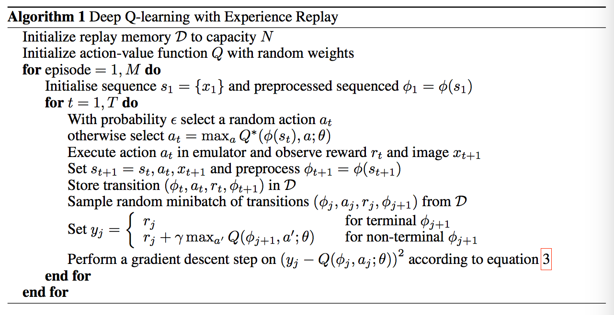
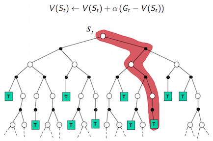
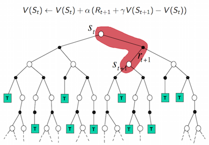

## Deep Q-learning with Experience Replay
- 首先初始化Momery D，它的容量为N；
- 初始化Q网络，随机生成权重$w$;
- 初始化target Q网络，权重$w^-=w$
- 循环遍历episode=1,2,...,M;
    - 初始化initial state $S_1$;
    - 循环遍历step=1,2,...,T;
        - 用$\epsilon-greedy$策略生成action $a_t$: 以$\epsilon$的概率随机选择一个action，或选择$a_t=max_{a}Q(S_{t},a;w)$;
        - 执行action $a_t$，接收reward $r_t$及更新state $S_{t+1}$;
        - 将transtion$(S_t,a_t,r_t,S_{t+1})$样本存入D中；
        - 从D中随机抽取一个minibatch的transtion$(S_j,a_j,r_j,S_{j+1})$;
        - 令$y_j=r_j$,如果j+1步是terminal的话，否则，令$y_j=r_j+\gamma max_{a'}Q(S_{t+1},a';w^-)$;
        - 对$(y_j-Q(S_{j},a_j;w))^2 关于w使用梯度下降法进行更新$；
        - 每隔C steps更新target Q网络，$w^-=w$。
    - 循环结束
- 循环结束

## $\epsilon-greedy策略$
$greedy$策略，顾名思义，是一种贪婪策略，它每次都选择使得值函数最大的action，即$a_t=max_{a}Q(S_{t},a;w)$。但是这种方式有问题，就是对于采样中没有出现过的(state, action) 对，由于没有评估，没有Q值，之后也不会再被采到。

其实这里涉及到了强化学习中一个非常重要的概念，叫Exploration & Exploitation，探索与利用。前者强调发掘环境中的更多信息，并不局限在已知的信息中；后者强调从已知的信息中最大化奖励。而$greedy$策略只注重了后者，没有涉及前者。所以它并不是一个好的策略。

而$\epsilon-greedy$策略兼具了探索与利用，它以$\epsilon$的概率从所有的action中随机抽取一个，以$1-\epsilon$的概率抽取$a_t=max_{a}Q(S_{t},a;w)$。

强化学习正是因为有了探索Exploration，才会常常有一些出人意表的现象，才会更加与其他机器学习不同。例如智能体在围棋游戏中走出一些人类经验之外的好棋局。

参考：[强化学习—DQN算法原理详解](https://wanjun0511.github.io/2017/11/05/DQN/)

## 值函数求解
### Monte Carlo

- MC使用一个完整的episode去更新值函数，因此它需要从$S_t$到Terminal state的完整样本。
- 而且需要等到episode结束才更新值函数。
- 由于需要一条完整的样本，它可以计算出return，而值函数是return的期望，所以可以用return去更新值函数。

### Temporal Difference

- 与MC不一样，TD不需要完整的样本，它只依赖下一个step的值函数，即它用$V(S_{t+1})$去更新$V(S_t)$(TD),或用$Q(S_{t+1},a_{t+1})$去更新$Q(S_{t},a_{t})$(SarSa)。
- 它不用等到episode结束，每走一步就可以更新值函数。
- 它不是用真实的return值来更新值函数，而是用一个估计值去更新另一个估计值的思想。

**DQN属于Model Free算法，它需要采样**。且同SarSa类似，只依赖于下一个step的值函数。但它更新值函数的方式与SarSa又有所不同。

